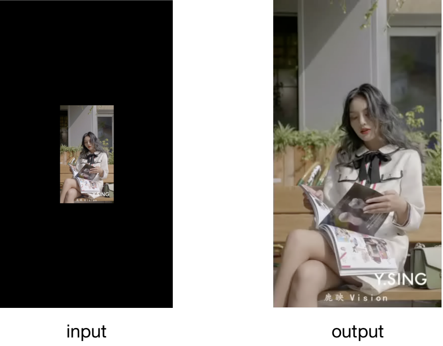
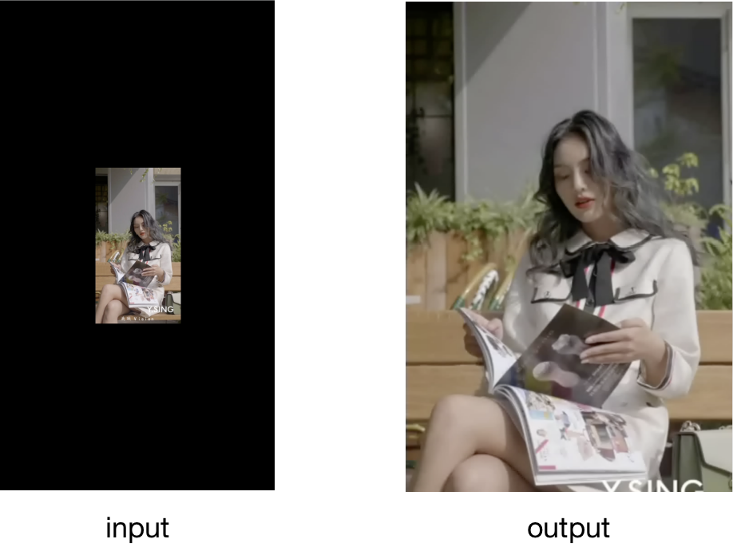
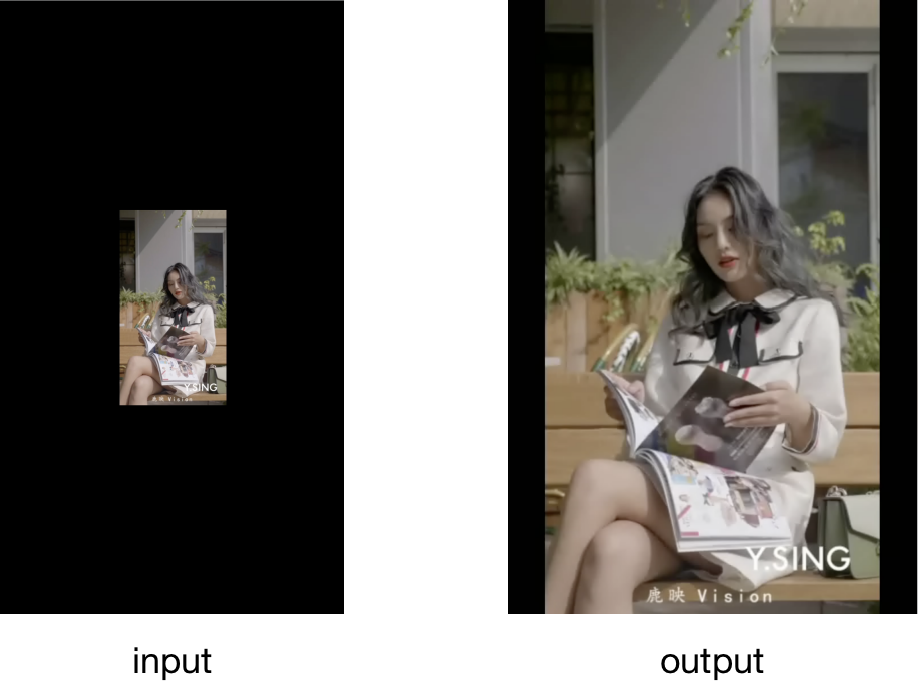
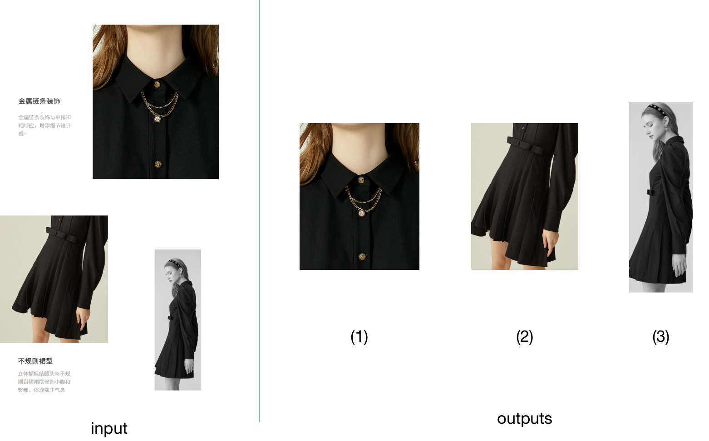

### Color based image/video crop

This repo is a simple tool to cut image or video based on color by python. You can remove the annoying padding with a simple command.

### Usage and results

There are a few differences between cropping a video and cropping an image.

#### Crop Video

Steps:

(1) Auto detect the padding color with the four corners of the video or Use the padding color specified by user.

(2) Find the hsv space range with the padding color.

(3) Get the color mask of the first frame with the hsv space range.

(4) Cut all frames with the mask of the first frame. Once along width and Once along height.

(5) Resize all frames to the desired output size.

Commands:

Just input the video and give an output path.

```
python3 codes/crop_video_by_content.py --input_video ./data/1.mp4 --output_video ./results/videos/1.mp4
```

<div align="center">
    <br>
    auto crop
</div>

Resize the image and crop to the output size.

```
python3 codes/crop_video_by_content.py --input_video ./data/1.mp4 --output_video ./results/videos/1_720x1080.mp4 --output_size 720x1080
```

<div align="center">
    <br>
    resize and crop
</div>

Resize the image and pad to the output size

```
python3 codes/crop_video_by_content.py --input_video ./data/1.mp4 --output_video ./results/videos/1_720x1080_pad.mp4 --output_size 720x1080 --pad_mode outside
```

<div align="center">
    <br>
    resize and pad
</div>

#### Crop Image

Steps:

(1) Auto detect the padding color with the four corners of the image or Use the padding color specified by user.

(2) Find the hsv space range with the padding color.

(3) Get the color mask of the image with the hsv space range.

(4) Cut image with the mask. Once along width and twice along height.

(5) Resize all frames to the desired output size.

Command:

```
python3 codes/crop_image_by_content.py --input_image ./data/5.jpeg --output_image_dir ./results/images/5/
```

<div align="center">
    <br>
    auto crop
</div>

You can also specify the output size just like it does while cropping a video.

### To do

- [x] Improve the accuracy of auto detecting padding color.
- [ ] Refer to more frames while cutting a video.